# 立杰人力资源管理系统

[](https://www.python.org/downloads/)
[](LICENSE)

一款基于 Python + pywebview 的本地人力资源管理系统，支持员工管理、做货记录、工资计算等功能。

---

## 功能特性

### 核心功能
- **资源总览** - 系统导航首页，快速访问各功能模块
- **成员管理** - 员工档案管理，支持批量导入
- **成员详情** - 查看员工历史工资记录和做货明细
- **部门管理** - 大部门/小部门两级结构管理
- **订单管理** - 订单与型号关联管理
- **型号单价表** - 设置各型号在不同小部门的单价
- **做货编辑** - Excel 风格录入做货对数，Tab 跳转，自动保存
- **快捷计算** - 实时工资计算，支持大部门分组表格
- **总工资表** - 按部门汇总全厂工资，支持数据源切换
- **系统设置** - 外观、字体、表格、颜色主题等个性化设置

### 技术特点
- 纯本地运行，无需网络连接
- 数据存储在本地 SQLite 数据库
- 支持深色/浅色模式切换
- 支持自定义颜色主题
- 表格自适应显示（自动分组、紧凑模式）

---

## 快速开始

### 环境要求
- **Windows 7/10/11**
- **Python 3.8 或更高版本**（如果没有，脚本会提示下载）

### 启动方式

#### 方式一：双击启动（推荐）
```
双击 run.vbs    ← 无命令行窗口（推荐）
双击 run.bat    ← 显示命令行窗口（用于调试）
```

#### 方式二：命令行启动
```bash
# 使用系统 Python
python main.py

# 或使用 venv（如果已创建）
venv\Scripts\activate.bat
python main.py
```

### 首次运行
1. 如果没有安装 Python，会弹出提示框引导下载
2. 首次运行会自动创建虚拟环境（venv）并安装依赖
3. 如果移动了项目文件夹，venv 会自动重建

---

## 项目结构

```
LMS/
├── main.py              # 程序入口（启动 FastAPI + pywebview）
├── api_server.py        # FastAPI 后端服务
├── api.py               # pywebview JS 桥接层
├── services/
│   ├── db.py           # 数据库连接管理
│   └── crud.py         # 数据库 CRUD 操作
├── database/
│   ├── db_manager.py   # 数据库初始化与迁移
│   └── schema.sql      # 数据库表结构定义
├── web/                 # 前端文件
│   ├── index.html      # 主页面
│   ├── css/
│   │   └── style.css   # 样式文件
│   └── js/             # JavaScript 模块
│       ├── init.js
│       ├── state.js
│       ├── utils.js
│       ├── api.js
│       ├── nav.js
│       ├── member.js
│       ├── dept.js
│       ├── order.js
│       ├── price.js
│       ├── work-edit.js
│       ├── salary-summary.js
│       ├── quick-calc.js
│       └── settings.js
├── venv/               # Python 虚拟环境（自动创建）
├── data.db             # SQLite 数据库（自动创建）
├── requirements.txt    # Python 依赖
├── run.bat            # Windows 启动脚本（带控制台）
├── run.vbs            # Windows 启动脚本（无控制台）
├── build.bat          # 打包脚本（图形界面）
├── build.py           # 打包脚本（命令行）
├── build.spec         # PyInstaller 配置
├── seed_data.py       # 测试数据生成
├── README.md          # 本文件
├── API_DOC.md         # API 接口文档
└── LICENSE            # MIT 许可证
```

---

## 开发说明

### 启动开发服务器
```bash
# 安装依赖
pip install -r requirements.txt

# 启动开发服务器（仅后端 API）
python api_server.py

# 或启动完整应用
python main.py
```

### 生成测试数据
```bash
python seed_data.py
```

---

## 便携版说明

### 关于 venv 的注意事项
Windows 上的 Python venv **无法真正做到随文件夹移动**，因为：
- venv 中的 `python.exe`、`pip.exe` 等可执行文件会硬编码 Python 解释器的绝对路径
- 不同机器的 Python 安装路径不同

### 解决方案
本项目已采用以下方案解决这个问题：

1. **自动检测** - 启动时检测 venv 是否有效
2. **自动重建** - 如果 venv 损坏（如移动文件夹后），自动删除并重建
3. **友好提示** - 如果没有 Python，提示用户下载安装

### 迁移到新机器
将项目文件夹复制到新机器后：
1. 确保已安装 Python 3.8+
2. 双击 `run.vbs` 或 `run.bat`
3. 脚本会自动重建 venv 并安装依赖

### 创建真正的便携版（无 Python 依赖）

如果需要在**没有 Python 的机器**上运行，可以使用 **PyInstaller** 打包成独立的可执行文件。

#### 方法一：使用图形界面打包（推荐）
```
双击 build.bat
```
然后按提示选择：
- `[1]` 正常版本 - 无控制台窗口（推荐给用户使用）
- `[2]` 调试版本 - 带控制台窗口（用于排查问题）
- `[3]` 清理构建文件

#### 方法二：使用命令行打包
```bash
# 打包正常版本（无控制台窗口）
python build.py

# 打包调试版本（带控制台窗口）
python build.py --debug

# 仅清理构建文件
python build.py --clean
```

#### 打包后的文件
打包完成后，可执行文件位于 `dist/` 目录：
```
dist/
├── 立杰人力资源管理系统.exe          # 主程序
├── web/                              # 前端文件（自动包含）
├── database/                         # 数据库文件（自动包含）
└── data.db                           # 数据文件（如果存在）
```

#### 分发说明
将 `dist/` 文件夹整体复制到目标机器即可运行，**无需安装 Python**。

**注意：**
- 打包后的文件体积约 20-50MB（包含 Python 运行时）
- 首次启动可能稍慢（需要解压资源）
- 建议先运行调试版本测试是否正常

---

## 版本历史

### v2.2（当前版本）
- 新增加载页面，解决启动时白屏问题
- 优化资源总览页面布局（常用功能/全部功能分组）
- 做货编辑页添加清除对数按钮
- 改进 venv 自动重建机制
- 添加 PyInstaller 打包配置，支持生成无 Python 依赖的便携版
- 更新 README 和 API 文档

### v2.1
- 新增成员详情页
- 新增订单管理功能
- 新增系统设置页面
- 表格自适应显示优化
- 快捷计算功能重构

### v2.0
- 全新架构：pywebview + FastAPI
- 新增订单-型号关联
- 数据库结构升级（v1→v2 自动迁移）
- 做货编辑功能重写
- 快捷计算功能新增

---

## 截图

### 资源总览
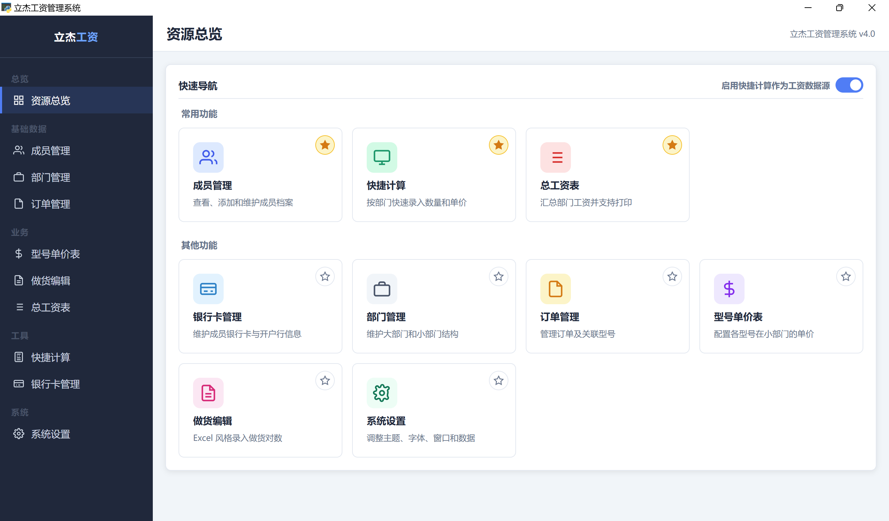

### 成员管理
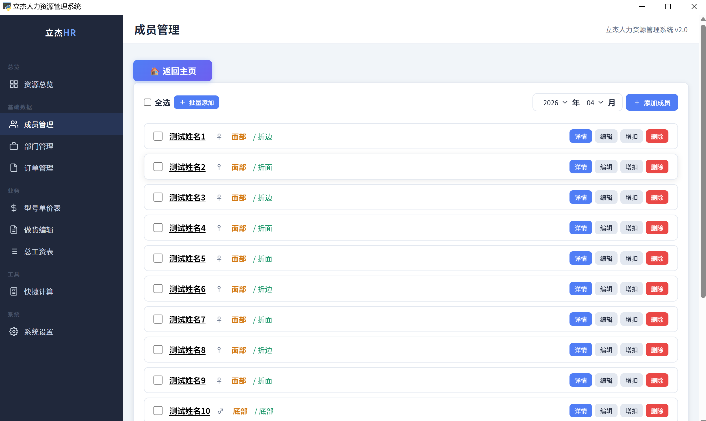

### 成员详情
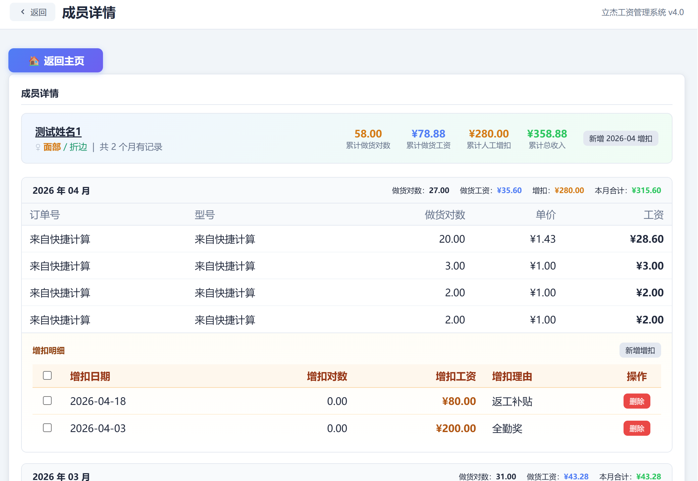

### 部门管理
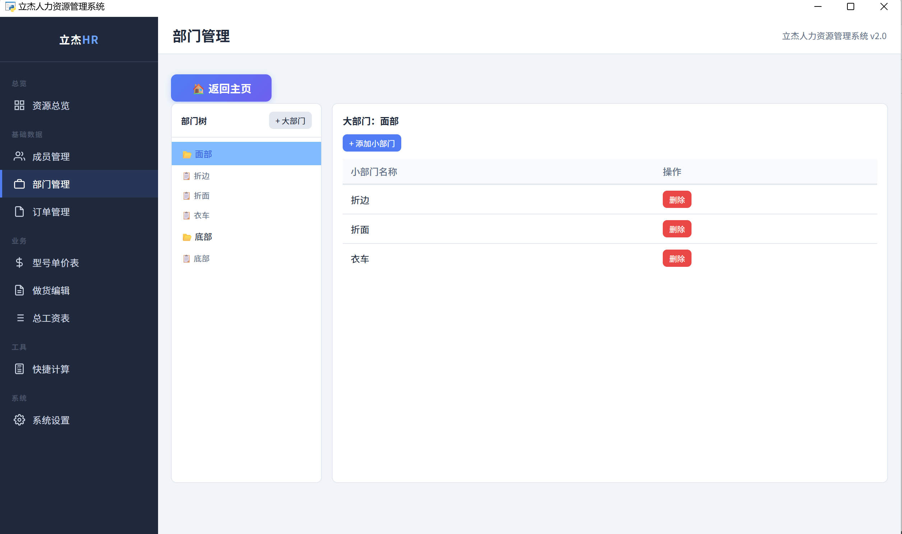

### 订单管理
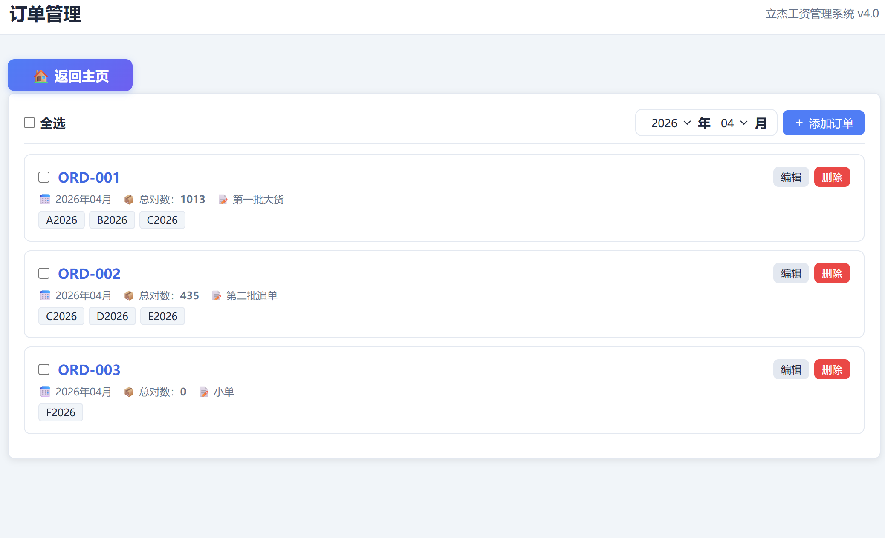

### 型号单价表
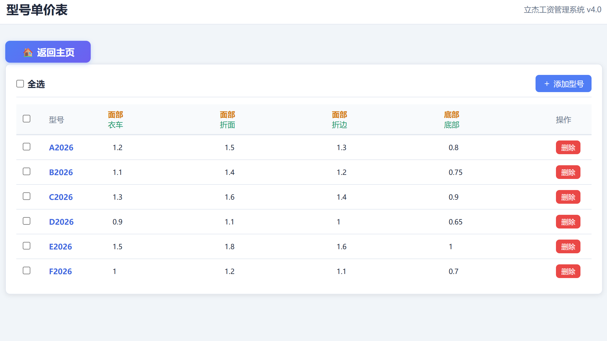

### 做货编辑
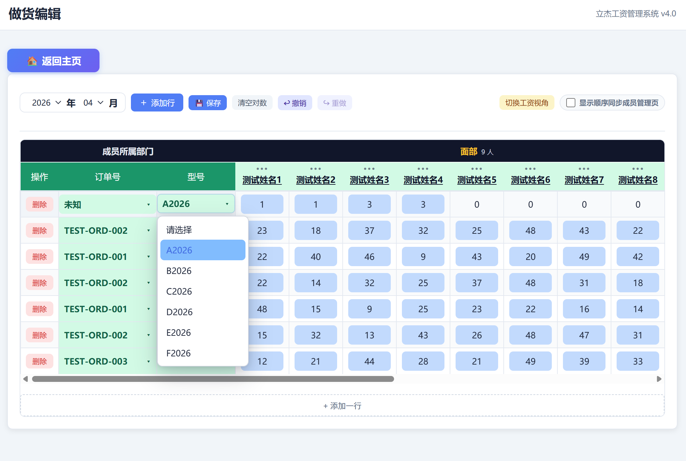

### 快捷计算
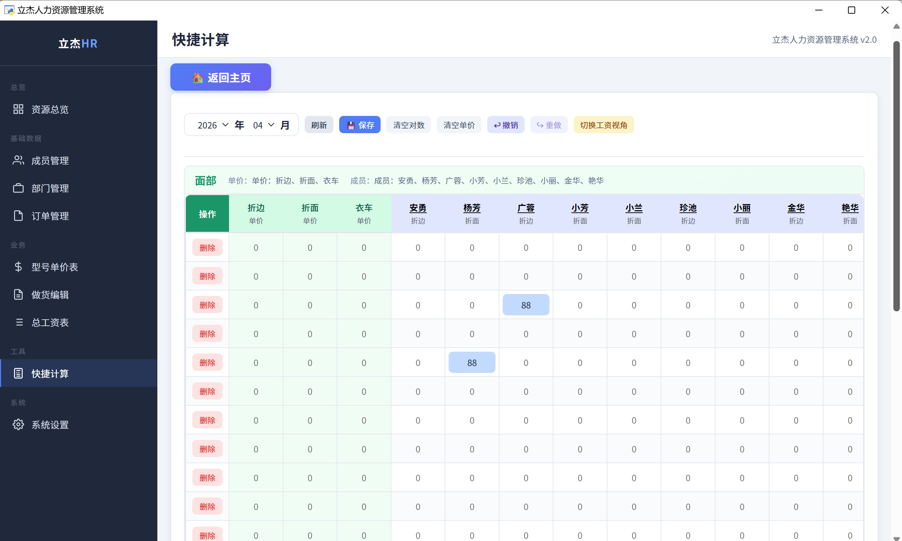

### 总工资表
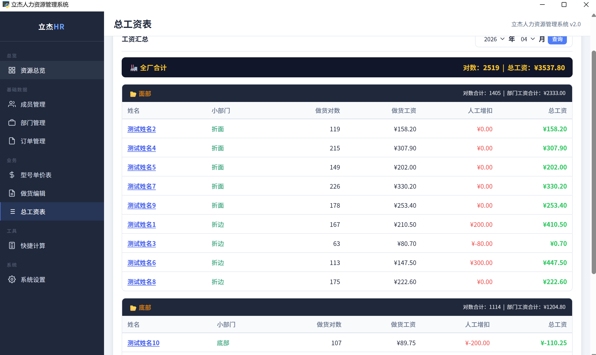

### 系统设置
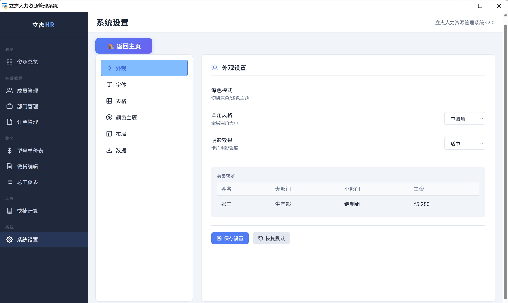
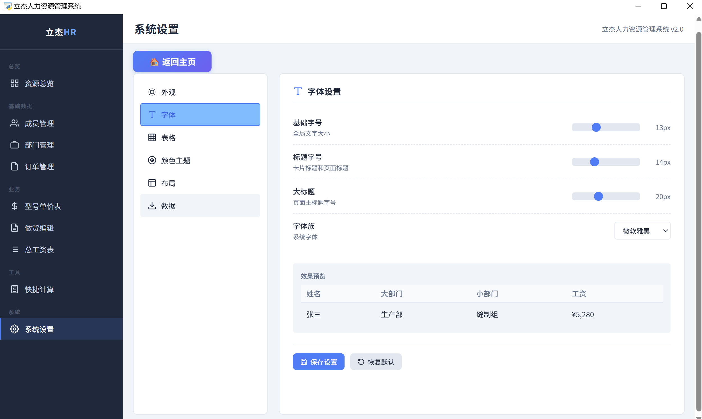
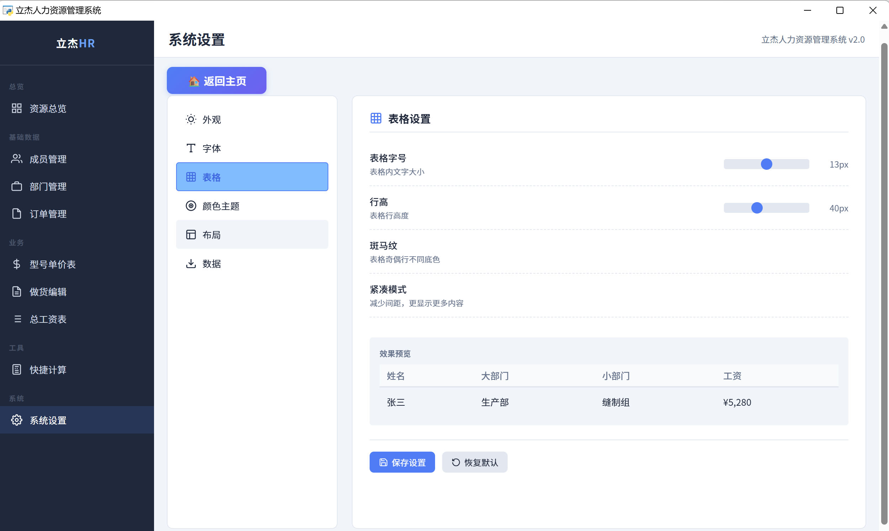
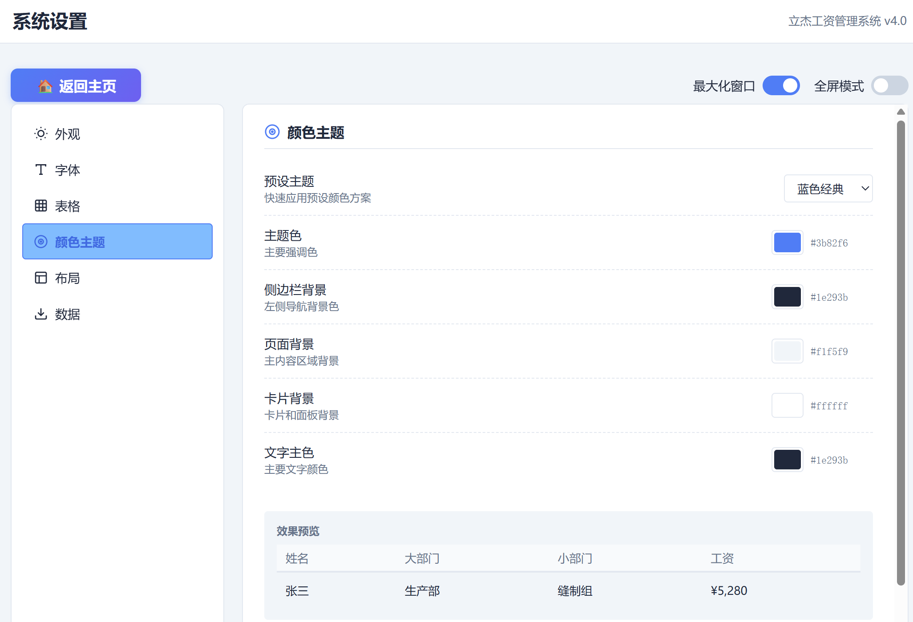

---

## 截图清单

| 文件名 | 说明 |
|--------|------|
| `screenshot-overview.png` | 资源总览页面 |
| `screenshot-members.png` | 成员管理页面 |
| `screenshot-member-detail.png` | 成员详情页面 |
| `screenshot-depts.png` | 部门管理页面 |
| `screenshot-orders.png` | 订单管理页面 |
| `screenshot-prices.png` | 型号单价表页面 |
| `screenshot-work-edit.png` | 做货编辑页面 |
| `screenshot-quick-calc.png` | 快捷计算页面 |
| `screenshot-salary.png` | 总工资表页面 |
| `screenshot-settings-appearance.png` | 系统设置-外观 |
| `screenshot-settings-fonts.png` | 系统设置-字体 |
| `screenshot-settings-table.png` | 系统设置-表格 |
| `screenshot-settings-colors.png` | 系统设置-颜色主题 |

---

## 许可证

[MIT](LICENSE) © 2026 立杰人力资源管理系统
