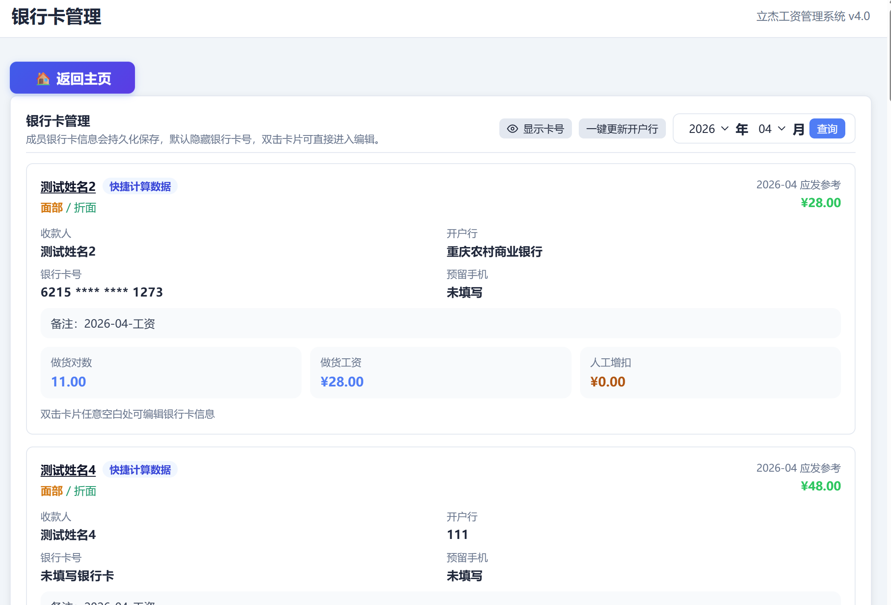
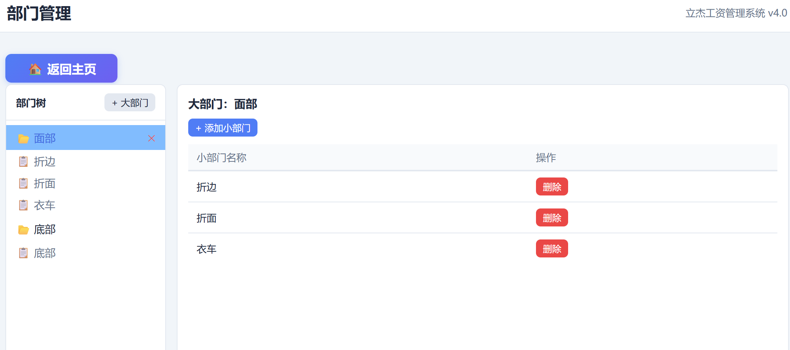

# 立杰工资管理系统

[](https://www.python.org/downloads/)
[](LICENSE)
[](https://www.microsoft.com/windows)

一款基于 **Python + FastAPI + pywebview** 的本地离线工资管理工具，面向日常工资录入、计件统计、成员档案管理与便携式使用场景。系统数据存储在本地 `SQLite`，默认无需联网即可运行。

---

## 界面预览

### 首页总览

系统导航首页，可快速进入各功能模块，并切换“总工资表”的工资数据源。


### 成员管理

卡片式展示成员信息，支持单个新增、编辑、删除、批量添加与批量删除。


### 成员详情

查看成员按月汇总的做货工资、快捷计算工资来源、历史做货明细，以及可按月维护多条增扣记录。


### 银行卡管理

集中展示成员银行卡信息，支持双击编辑、自动保存、卡号打码/完整显示切换。



### 做货编辑

Excel 风格录入做货对数，支持新增行、删除行、自动保存、撤销重做、工资视图切换与键盘快速录入。


### 快捷计算

按大部门分组录入数量与单价，实时计算工资，可作为总工资与成员详情的数据源。


### 总工资表

按部门汇总全厂工资，支持做货编辑 / 快捷计算双数据源切换，并提供彩色打印与黑白打印。


### 订单管理与型号单价

管理订单、关联型号，并维护各型号在不同小部门下的单价。


### 部门管理

维护大部门 / 小部门两级结构，为成员归属、快捷计算与工资汇总提供基础数据。



### 系统设置

支持主题模式、颜色主题、字体、表格显示、窗口参数、数据库导入导出等个性化配置。


---

## 功能特性

- **本地离线运行**：工资、成员、订单、单价与设置全部保存在本地 SQLite。
- **首页总览**：统一入口，快速跳转各模块，并显示当前系统状态。
- **成员管理**：支持成员新增、编辑、删除、批量导入与批量删除。
- **成员详情**：展示成员月度工资、做货明细、快捷计算来源明细与历史记录。
- **增扣明细管理**：同一成员同一月份可维护多条增扣记录，支持新增、单条删除和批量删除。
- **银行卡管理**：集中维护银行卡号、开户人、开户行，支持卡号显隐状态持久化。
- **部门管理**：维护大部门 / 小部门两级结构。
- **订单管理**：按年月管理订单、备注及关联型号。
- **型号单价表**：维护型号在不同小部门下的单价矩阵。
- **做货编辑**：支持 Excel 风格录入、工资视图切换、撤销重做、自动保存、删除行。
- **快捷计算**：支持按部门快速计算工资，并可作为工资数据源参与汇总。
- **总工资表**：按部门统计总工资，并支持彩色打印、黑白打印。
- **外观设置**：支持浅色、柔和、深色、跟随系统四种主题模式。
- **个性化配置**：支持颜色、字体、圆角、阴影、表格密度、窗口分辨率等设置。
- **数据维护**：支持数据库导入、导出、业务数据清理。
- **便携使用**：支持 PyInstaller 打包，适合拷贝到其他 Windows 电脑直接使用。
- **单实例限制**：防止重复打开多个程序实例。

---

## 快速开始

### 环境要求

- Windows 7 / 10 / 11
- Python 3.8+

### 启动

```bash
# 推荐：双击启动（无命令行窗口）
run.vbs

# 或命令行启动
python main.py
```

首次运行会自动创建虚拟环境（`venv/`）并安装依赖；如果移动了项目目录，`venv` 会自动重建。

### 打包为独立可执行文件

如需在无 Python 环境的机器上运行，可使用 PyInstaller 打包：

```bash
# 图形菜单打包（推荐）
build.bat

# 命令行打包
python build.py          # 无控制台窗口
python build.py --debug  # 带控制台窗口，便于调试
```

打包产物位于 `dist/` 目录，将整个产物文件夹复制到目标机器即可运行。

---

## 项目结构

```text
立杰工资管理系统/
├─ main.py                # 程序入口（启动 FastAPI + pywebview）
├─ api_server.py          # FastAPI 后端服务
├─ api.py                 # pywebview JS 桥接层
├─ services/
│  ├─ db.py               # 数据目录 / 数据库路径管理
│  └─ crud.py             # 主要业务 CRUD
├─ database/
│  ├─ db_manager.py       # 数据库初始化与迁移
│  └─ schema.sql          # 数据表结构
├─ web/
│  ├─ index.html          # 主页面
│  ├─ css/style.css       # 全局样式
│  └─ js/                 # 前端模块脚本
├─ b.json                 # 银行缩写与全称映射表
├─ data.db                # SQLite 数据库（自动创建）
├─ requirements.txt       # Python 依赖
├─ run.bat / run.vbs      # Windows 启动脚本
├─ build.bat / build.py   # PyInstaller 打包脚本
└─ seed_data.py           # 测试数据生成
```

---

## 开发

```bash
# 安装依赖
pip install -r requirements.txt

# 启动应用
python main.py

# 生成测试数据
python seed_data.py
```

---

## 许可协议

[MIT](LICENSE) © 2026 立杰工资管理系统
